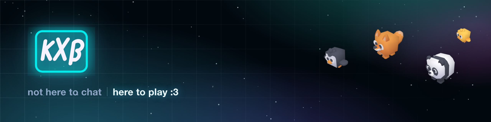

<p align="center">
  
</p>

# kxb

A browser-based virtual arcade with a chill lounge, built for groups and one-off
events. You send a link; whoever opens it picks a name and an animal and is
standing in the 3D world seconds later, with no account and nothing to install.

Inside there is a lounge with emotes and chat, a football pitch, battles and
tournaments, a café, a house and garden, and a level editor — alongside the flat
surfaces (pages, members, rooms) that a space which keeps running needs.

> **No 3D models or audio are bundled here.** They are CC0 and belong to four
> people who publish them themselves, so this repository points at them rather
> than mirroring 237 MB of their work. [docs/assets.md](docs/assets.md) is how
> you fetch them, and what runs without them.

## Two problems, pulling opposite ways

Most of what is interesting here comes from holding both of these at once.

**Everything durable is event-sourced.** No command mutates a row. It loads a
stream, folds it into state, asks a pure `decide()` what should happen, and
appends the result under the version it read. Deciding, folding and projecting
are all plain TypeScript; the only thing that is not is the atomic append, which
has to be a Postgres function because the batch and its version check need one
transaction. Data is scoped to a **workspace** — every event carries a
`tenant_id`, RLS asks "are you a member of this tenant" rather than "do you own
this row", and membership is itself an event-sourced aggregate with roles and
invitations.

**Nothing in the middle is authoritative.** There is no game server. Browsers
talk to each other over Supabase Realtime, which relays and stores nothing, and
the Next.js tier is not in the path at all — which is why an app deploy never
disconnects a live room. So for every moving thing in a world, *someone* has to
be trusted with it, and the answer is deliberately not uniform: three different
authority models are in use, each chosen against what the alternative would
cost. That reasoning is [docs/architecture/netcode.md](docs/architecture/netcode.md), and it is the
document to read first if you only read one.

The seam between them is the point. A punch that lands is a durable event; the
arm that threw it is not.

## Where to start reading

| If you want | Read |
|---|---|
| The hardest reasoning in the repo | [docs/architecture/netcode.md](docs/architecture/netcode.md) — who is authoritative over what, and why never "the server" |
| The write side, in detail | [docs/architecture/event-sourcing.md](docs/architecture/event-sourcing.md) — and [`src/es/`](src/es), which is the whole core in under 900 lines |
| The multiplayer world itself | [`src/app/world/lounge/`](src/app/world/lounge) |
| The level editor and its format | [`packages/xp/`](packages/xp) and [docs/xp/manual.md](docs/xp/manual.md) |
| To run it | [Getting started](#getting-started), below |

Roughly 200k lines of TypeScript excluding tests, **close to 7,000 tests that
need no database** and run in seconds, and 188 migrations.

## Stack

| | |
|---|---|
| Framework | Next.js 16 (App Router, Server Actions) |
| Runtime / package manager | Bun |
| Database & auth | Supabase (Postgres + GoTrue), local via the Supabase CLI |
| Validation | Zod |
| Styling | Tailwind CSS v4 |
| 3D | React Three Fiber |

## Getting started

Requires [Bun](https://bun.sh) and Docker (for the local Supabase stack).

```bash
bun install
bun run dev
```

Then open <http://127.0.0.1:3000>.

`dev` starts the local Supabase stack in Docker if it is not already up, reads
its URL and keys from `supabase status`, and writes them into **`.env.local`**
before starting Next. There is no anon key to copy by hand: the local keys are
generated per install, so they are refreshed on every run. The merge only
rewrites the Supabase-and-URL lines — anything else you keep in `.env.local` is
preserved.

Everything else you might set is documented, with its failure mode, in
[`.env.example`](.env.example). None of it is required to start.

The world will be empty until you fetch the art — see
[docs/assets.md](docs/assets.md).

## Tests

```bash
bun test src packages
```

They need no database and no network, and finish in seconds. A handful fail on
a fresh clone — every one of them an asset-integrity test reporting, correctly,
that the art is not here yet. See [docs/assets.md](docs/assets.md).

```bash
bun run test:core
```

is the same suite without those, which is what CI runs and what should be green.

```bash
bunx tsgo -p tsconfig.check.json --noEmit   # types
bunx eslint                                 # lint
```

## Layout

| | |
|---|---|
| `src/es/` | The event-sourcing core: append, fold, project. Pure. |
| `src/domain/` | One directory per aggregate — events, `decide()`, projections, queries. |
| `src/app/` | Next.js routes, Server Actions, and the 3D worlds under `world/`. |
| `src/app/xp/` | The level editor (`_editor/`) and its runtime (`_runtime/`, `_hosts/`). |
| `packages/xp/` | The engine: level format, character controller, script sandbox. No React, no three.js, no browser globals. |
| `packages/boxing/`, `packages/maumau/` | Two games built on it. |
| `supabase/migrations/` | 188 migrations. The schema is the log plus its read models. |
| `docs/` | Architecture, the XP manuals, and the world notes. |

## Contributing

See [CONTRIBUTING.md](CONTRIBUTING.md). The short version: the tests run in
seconds and need nothing installed, so run them.

## Author

Built by **Jens Bösche** — [kappaxbeta](https://github.com/kappaxbeta).

| | |
|---|---|
| Site | [kxb.team](https://kxb.team) |
| Community | [kxb.team/community](https://kxb.team/community) |
| GitHub | [@kappaxbeta](https://github.com/kappaxbeta) |
| Instagram | [@kxbteam](https://instagram.com/kxbteam) |
| X | [@kxbteam](https://x.com/kxbteam) |

[kxb.team](https://kxb.team) is where it runs, hosted, with the art in place and
nothing to set up. [kxb.team/community](https://kxb.team/community) is the
community handbook — a separate thing to this repository, about starting and
running an independent business.

## Deploying

There is no deploy pipeline here, deliberately: how you ship it is a decision
about your own infrastructure, and a workflow that assumed otherwise would be
one more thing to delete before you could use it. `bun run dev` is the whole
supported path. A `Dockerfile` is included and builds the app; Caddy, TLS, DNS
and the database are yours.

If you put it online in the EU, fill in `src/app/legal/shell.tsx` before you do
— it is a researched § 5 DDG imprint template with placeholder details, and
shipping it as-is names nobody.

## Licence

MIT — see [LICENSE](LICENSE). Copyright © 2026 Jens Bösche (kappaxbeta).

The art is **not** covered by that licence, is not in this repository, and is
not ours to relicense. Every pack is CC0 and belongs to
[Kay Lousberg](https://kaylousberg.itch.io/),
[Kenney](https://kenney.nl/) and
[Isa Lousberg](https://tinytreats.itch.io/). Please support them.
