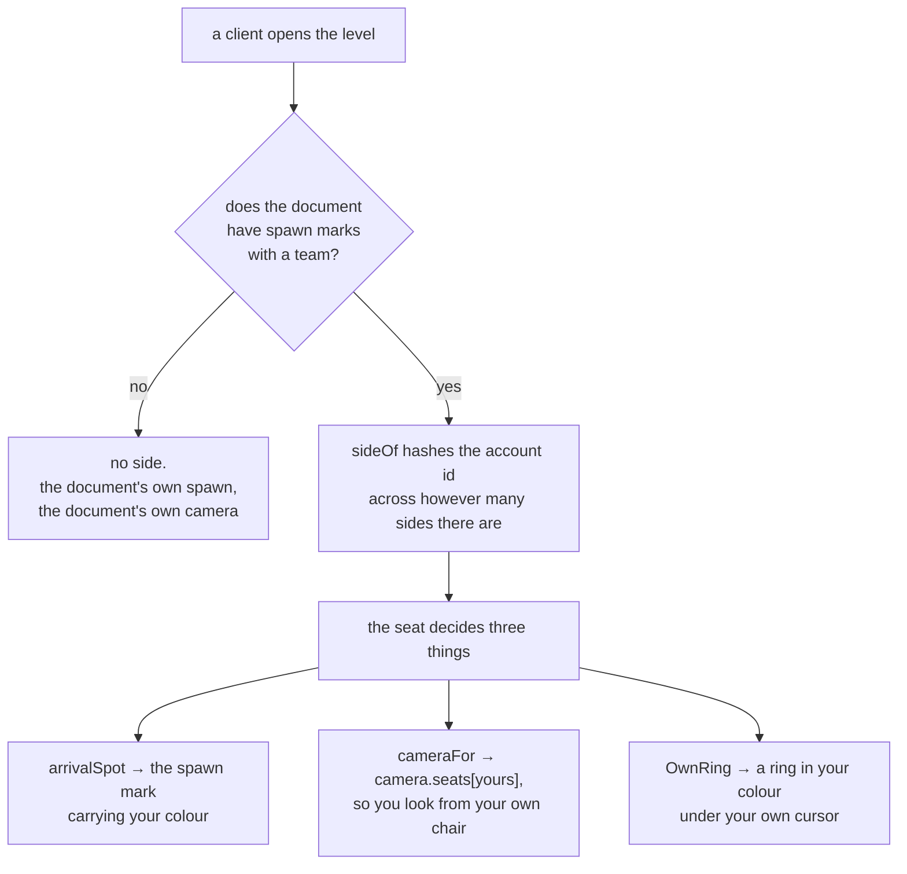
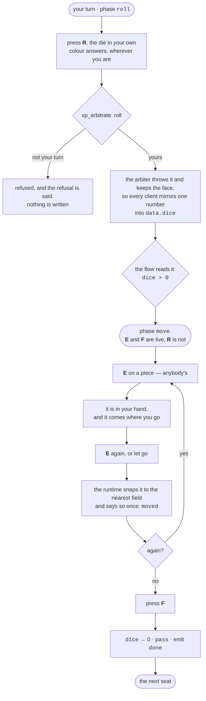
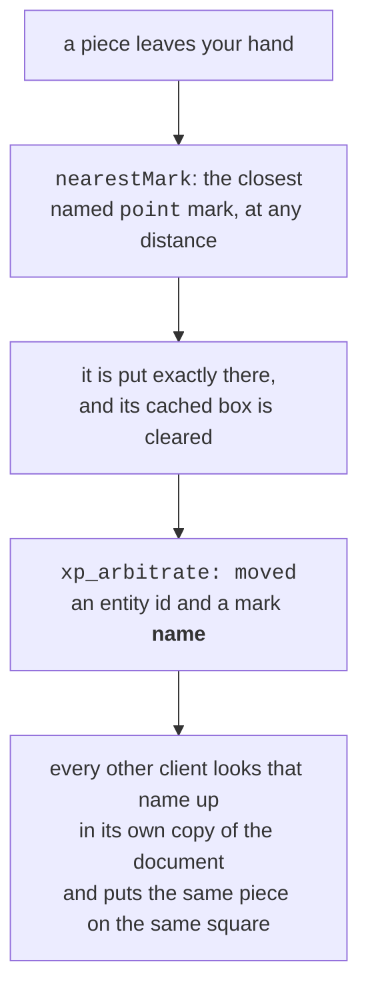
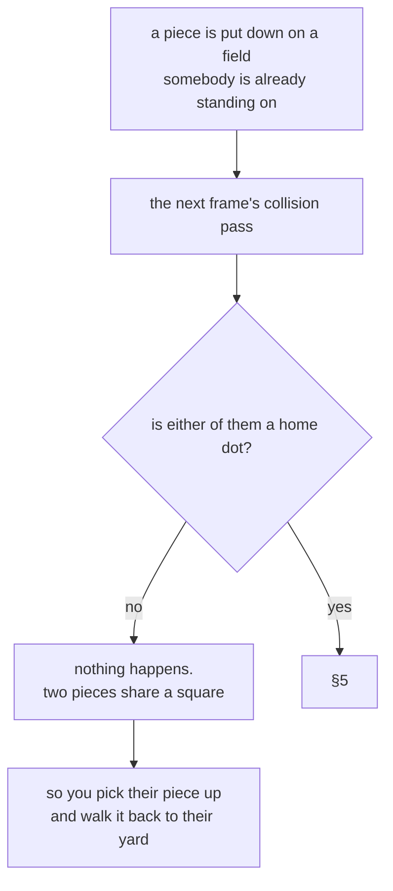
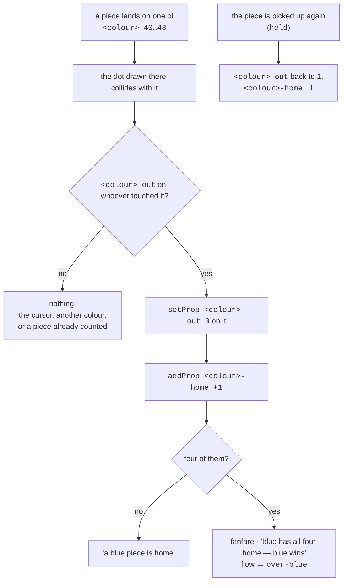

# The round, end to end

What actually happens between one player's turn starting and the next one's,
for a table-shaped XP — `mensch.xp.json` is the one that exists. Written down
because the loop runs through four places that cannot see each other: a
document, a client, a Postgres function, and a socket.

**This is the *record* of one game's round.** The general version — a `flow`
block a document writes instead of encoding its round in triggers, with an
editor that draws it — is proposed in xp-flow.md, and this file is
the thing it has to be able to express. Read this one first: every constraint in
that proposal came from something on this page.

**This describes what is built.** Everything in the charts below is reachable
today; what is not is in [Not yet](#not-yet), separately, so this file cannot
quietly become a plan.

Read alongside server-authority.md §4 for why the dice
belongs to the arbiter, and backlog.md §7e for how the board got
here.

---

## 1. Sitting down

**Nothing is transmitted.** A side is derived from an account id, so every
client works out every other client's side with no extra bytes on the wire and
without the two of them ever disagreeing — see [`teams.ts`](../../src/app/xp/_runtime/match/teams.ts)
for why that is worth more than it looks. It also has to be known on the *first*
frame, because it decides where you arrive, and the presence roster arrives
milliseconds later.

**It is not balanced, and must not be called that.** A hash is even across many
rooms and says nothing about any one of them.

---

## 2. A turn

**The roll is advice.** Nothing in the document reads the face — not a condition,
not a verb. You throw, you read the number, and you move a piece by it or you do
not, in front of people who can see you. That is the whole of what replaced
`advance`, and a filmed game is what forced it: four hundred turns, nothing home,
every rule behaving exactly as written. The ring stays where you leave it, a
piece it moves leaves it, and nothing could ever select that piece again.

The verb is not gone from the format — see [manual.md](manual.md) §5, which is
also where the board it was built for is written down. It is gone from *this
document*, and §3 is what a board is without it.

**Three keys, three things, and none of them is a mode.** `use` is your hand,
`roll` is the die, `done` is your go. Before this, `use` was the move *and* the
end of the turn and which it meant was worked out from `dice`: three `pressed`
rules in one blueprint, ordered so that whichever of them spent the roll made the
rest false. It was correct, it was tested, and nobody could have guessed it from
the document — and it went with the verb it was a trick about.

**Which keys are live is a phase's answer now.** `flow` opens in `roll`, where
`allow` is `["roll"]` and nothing else does anything; a `when` on `dice > 0`
takes it to `move`, where `allow` is `["use", "done"]` and the die is no longer
live. A phase decides quietly, though, which is its own way of being unreadable —
*"after I rolled and placed the figure, what do I do then? There is no button"* —
so each one carries a `says` its author writes and the HUD draws under the phase
name.

**Your die, not the die.** Four of them, one beside each chair, plus the table's
own in the middle, and `by: "team:<colour>"` is what makes exactly one of them
answer — five dice are five entities and a press reaches all of them, so without
it a roll would be four rolls and the last to land would be the number everybody
read. They all roll into
the same field, because there is one number in a game of mensch and it is the one
everybody just watched land.

**It answers from anywhere, and that is not laziness.** The die had a `within: 3`
first, which makes it a thing you walk up to and throw — lovely in a level where
you stand still, and a disaster here, because a turn *is* carrying a piece across
the board. The reach was satisfied exactly once, from the chair you spawned in,
and from the second round on the button did nothing and said nothing: a press
narrowed by `aimOf` that finds nothing fires no rule at all. Your die is yours
because it is yours, not because you are standing next to it.

**Ending a turn is not a thing about an object, so it lives on the middle die and
nowhere else.** All five carried their own copy of *clear the roll, pass, say
done*, and a press with no `within` reaches all of them — one tap of `F` was five
passes and five round trips. Alone at a table that wraps back to you it looks
fine; at a table of three it skips two players every go. It needs no `by` gate of
its own: `pass` is refused by the arbiter unless the turn is yours.

**`E` is one key with two edges.** Tap it to pick a piece up and tap again to
place it, or hold it and carry — the same gesture either way, because the press
buffer withholds a quick tap's release and owes it to the next tap. It owes it
only to actions the level can hear a release of, and here that is `use` and
nothing else: `roll` has no `released` rule to pay the debt to, so the die
answered every *second* tap. Invisible on a keyboard, where a key held past the
threshold releases honestly, and unmissable on a phone, where a tap is the only
gesture there is.

**A turn ends because somebody says it does.** A turn is picking a piece up,
carrying it somewhere and putting it down — possibly twice, possibly changing
your mind halfway — so there is no move for the level to notice and no moment it
could call the end of a go. `F` clears the die, passes, and emits `done`, which
is the event the flow's arrow back to `roll` waits for.

**And a six does not go again.** That rule was the one thing the old ordering
bought, and it went with the verb: nothing here can tell a six that has been used
from one that has not. Like moving four squares on a four, it is now a rule the
people at the table keep.

---

## 3. Where a piece ends up

Nothing computes a move, so the board is not a track any more — it is 184 named
places and a rule about letting go.

**A drop snaps because a board has squares.** A piece is on one or it is being
moved, and one left a few centimetres off its own is a board that slowly stops
being readable — worse, *which field is that piece on* stops having an answer,
and that is the question every rule about a board asks.

**The snap is also what makes a move sayable.** A position is three floats to
broadcast and reconcile; a field is one short name, so a move travels the way the
roll does. It goes over the arbiter rather than the socket for the reason the
roll does too: a dropped position sample is a body that jumps, and a dropped
*move* is a board that is permanently wrong.

**The name is text, and that is not a detail.** While `advance` existed the
arbiter's `moved` took a track and an integer. Half the places a piece can be put
down are not numbered — `blue-yard` is where a knocked-out piece is carried back
to, and it is a place rather than a distance from anywhere.

**The numbering outlived the arithmetic.** Each colour still numbers the ring
`0…39` from its own entry field and turns off into `40…43` of its own, so the
forty physical squares carry four names each — `blue-20` and `red-0` are one
square. Nothing adds a roll to an index any more; what the numbers do now is give
a square a name to say and tell the home column apart from the ring. Which of a
square's four names a drop reports does not matter, because all four clients look
it up in the same document and arrive at the same place.

**Nothing is refused.** The nearest mark wins however far away it is: every drop
lands on a field, because on a board there is nowhere else for a piece to be. A
piece put on the wrong square is on the wrong square, and picking it up again is
the undo — which is the same undo everything else here has.

---

## 4. Landing on somebody

**The *ärgern* is a thing a person does.** It was a rule: a `collide` on the
piece, two on one field, and the one already standing sent itself back to its
yard. That rule is gone. A knockout nobody performs is the one move on this board
that happens to a piece nobody touched — and it is the move the game is named
after, so it is the last one that should happen by itself.

**The gate went with it.** `by: "team:<colour>"` sat on the press that moved a
piece and said that a piece answers only to the player sitting in its colour —
which it had to, while that press could send somebody else's piece home. You
cannot carry an opponent's piece back to their yard through a rule that says the
piece is not yours, so the two left in one go. A wrong grab is undone by putting
the piece back down.

**It could not have been written correctly anyway**, and that is the part worth
keeping. Every blue piece enters the board on `blue-0`, so *two on one field
sends the standing one home* applied to your own colour as well: the second piece
out knocked the first home, the third knocked the second, and four pieces spent
four hundred turns shuttling between a yard and one square. Every rule behaved
exactly as written and the game could not be finished. The house rule that fixes
it is *your own colour does not knock* — *this piece is not mine* **and** *it was
not the one that just moved*, which is two conditions, and `when` takes one.

**`collide` is still the only event another entity can set off**, and a condition
can still read the properties of whoever set it off. §5 is where that is used
now, and the property is `<colour>-out`. It is **edge-triggered per pair**, so a
piece that has landed and stayed does not fire again every frame.

---

## 5. Winning

There is **no arrival event** — a piece is put down by hand and snapped to the
nearest square, and neither of those is something a level can hang a rule on. So
home is an *entity standing on a home field*, and reaching one is a collision.

**All four home fields count, not just the last one.** The version before this
had a single post on `<colour>-43` and the implicit rule that all four pieces
stack on that one square. Nobody plays it that way — a home column has four
squares and you fill them — so one piece counted and the other three sat in
front of a post that could not see them. There was no way to end a game.

**The thing that counts is the dot the board already draws**, same model and
same place, with `collider: 'none'`. It was four flags on poles first and a home
column with four flagpoles in it does not read as a home column. A post with no
box is asked against `triggerBox`, half a metre either way, and the board's
squares are 1.6 apart — so the nearest square outside a home field is 0.6 clear
of counting itself home. `xps.test.ts` asserts that gap, because nothing else
can see it.

**`<colour>-out` is one property doing two jobs**, and that is the "Not yet"
below arriving early: a `when` takes one condition, and the rule needs *this is
a blue piece* **and** *it is not already home*. A property only blue pieces
carry, cleared the moment one is counted, is both — a green piece reads zero
because it has no such property at all.

The second trigger reads what the first one just wrote, and that it can is the
one piece of the old three-press turn still holding something up: `fire` walks a
blueprint's triggers in document order and applies each one's verbs *before* it
asks the next one's condition, and `setProp target: 'world'` writes straight into
the map a condition reads. Reorder these two and a fourth piece coming home is
announced before it is counted.

> **The guard is not decoration.** The post counted a piece home on a `collide`
> with no condition at all, so anything touching one scored — and the first thing
> anybody does is drive the cursor across the board. It was found by playing.

**Four ways to end, one per colour.** `over-blue`, `over-green`, `over-red`,
`over-yellow`, differing only in what they say. A `says` is a fixed string and
the winner is known — it is the counter that reached four — so a single `over`
phase saying *the game is over* was throwing away the one thing the screen
should show.

---

## 6. Who decides what

| | decided by | why there |
|---|---|---|
| the dice | **the arbiter** (`xp_arbitrate`) | the one thing a client must not own |
| whose turn it is | **the arbiter** | `pass` hands on your own turn and nobody else's |
| *when* a turn ends | **the player**, on `F` | nothing else can know when a carry is finished |
| which keys are live | **the document**, through `flow` | which phase a round is in is a rule about a game, and the arbiter has never been told any of those |
| which seat you are in | **every client, from your account id** | it decides where you arrive, so it cannot wait for a roster |
| where a piece goes | **a hand** — snapped to the nearest field, said once through the arbiter | nothing computes a move, so the only fact left is which field it ended up on |
| what the roll means | **the people at the table** | no rule reads the face — see §2 |
| who is home | **the document**, through a collision | there is no arrival event |

---

## Not yet

One thing, and it is the same one it has always been: **a trigger's `when` takes
one condition.**

Every rule on this board that wants two has had to buy the second somewhere else.
§5 buys it with `<colour>-out`, a property that means *blue* and *not already
home* at once and has to be kept in step by hand in three places. §4's house rule
could not buy it at all. The fix is a `when` that accepts a list, all of which
must hold; it is backwards-compatible, because every document on disk carries
exactly one.

**Two things that used to be listed here are not wanted any more**, and saying so
is the point of the section. *You can move somebody else's piece* was a gap while
a rule moved pieces; now it is how a knockout happens, and the gate that used to
enforce it was deleted on purpose. *Your own pieces share a field* was a missing
refusal; now it is the house rule that lets a game end, and there is nobody left
to refuse a move — a hand puts a piece where a hand puts it.
